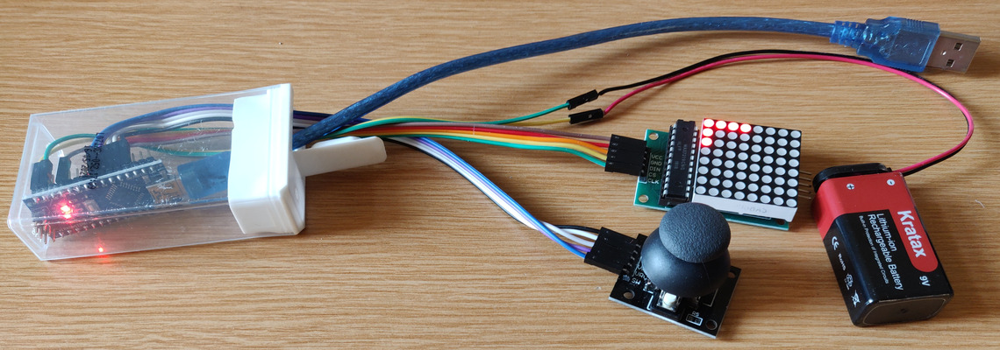

BTMachine
=========

## Play animations & games on an Arduino with an 8x8 LED matrix

* Start with an Arduino Nano or Uno
* Attach a MAX7219 driven 8x8 LED matrix
    * VCC to 5V
    * GND to GND
    * DIN to D2
    * CS to D3
    * CLK to D4
* Attach a mini joystick with a two-way rocker & push button
    * GND to A0 (or GND)
    * +5V to A1 (or 5V)
    * VRx to A2
    * VRy to A3
    * SW to A4
* Optionally attach an external power source to GND & VIN
* Flash the included btmachine.ino to the Arduino
* Use the companion app [State Machine Designer](https://github.com/bndeff/smd) on your Android phone to create animations and simple games
* Connect your phone to the Arduino with a USB cable to upload your design
* Once your project is uploaded, you no longer need the phone to play it on the Arduino

